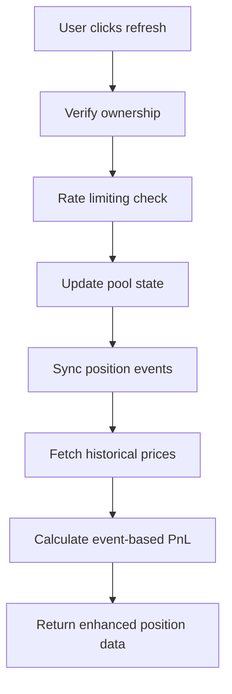
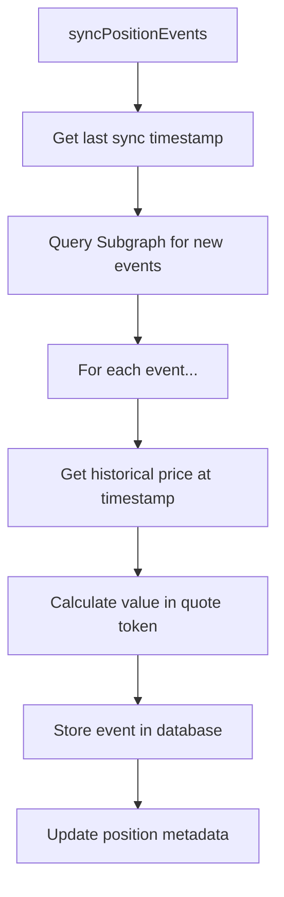

# Position Event Ledger Design

## Overview

This document describes the implementation of an event-based position ledger system for accurate PnL calculation in DUNCAN. The system tracks all position lifecycle events (creation, increases, decreases, fee collections) to provide precise historical valuations and comprehensive PnL breakdowns.

## Problem Statement

Currently, PnL calculation uses a simple formula:
```
PnL = currentValue - initialValue
```

This approach has significant limitations:
1. **No fee tracking** - Collected fees are not included in PnL
2. **Historical inaccuracy** - Initial value may use snapshot price, not actual entry price
3. **Missing realized vs unrealized** - Can't distinguish between withdrawn funds and paper gains
4. **Limited transparency** - Users can't see PnL attribution to specific actions

## Solution: Event-Driven Architecture

### Core Concept

Track every position action as immutable events with historical pricing:
```
Total PnL = Σ(all events valued at historical prices) + currentUnrealizedValue
```

### Event Types

1. **CREATE** - Initial position creation (first IncreaseLiquidity)
2. **INCREASE** - Additional liquidity added
3. **DECREASE** - Partial liquidity removal  
4. **COLLECT** - Fee collection without liquidity change
5. **CLOSE** - Complete position closure (liquidity = 0)

## Database Schema

### PositionEvent Model

```prisma
model PositionEvent {
  id              String   @id @default(cuid())
  positionId      String
  position        Position @relation(fields: [positionId], references: [id])
  
  // Event Type & Identity
  eventType       String   // "CREATE", "INCREASE", "DECREASE", "COLLECT", "CLOSE"
  timestamp       DateTime
  blockNumber     Int
  transactionHash String
  
  // Liquidity Changes
  liquidityDelta  String   // BigInt: +/- liquidity change
  
  // Token Amount Changes
  token0Delta     String   // BigInt: token0 added/removed
  token1Delta     String   // BigInt: token1 added/removed
  
  // Fee Collection (COLLECT events only)
  collectedFee0   String?  // BigInt: fee collected in token0
  collectedFee1   String?  // BigInt: fee collected in token1
  
  // Historical Pricing
  poolPrice       String   // BigInt: token0/token1 price at event time
  tick            Int      // Pool tick at event time
  
  // Valuations (in Quote Token smallest unit)
  valueInQuote    String   // BigInt: total position value change
  feeValueInQuote String?  // BigInt: fee value in quote token
  
  // Metadata
  source          String   // "subgraph", "onchain", "manual"
  confidence      String   // "exact", "estimated"
  createdAt       DateTime @default(now())
  
  // Indexes for performance
  @@index([positionId, timestamp])
  @@index([positionId, eventType])
  @@index([transactionHash]) // Deduplication
}
```

### Position Model Updates

```prisma
// Add to existing Position model:
model Position {
  // ... existing fields ...
  
  // Event ledger tracking
  events          PositionEvent[]
  lastEventSync   DateTime?
  totalEventsCount Int @default(0)
  
  // Fee aggregates (cached for performance)
  totalFeesCollected String @default("0") // Sum of all COLLECT events
}
```

## System Architecture

### 1. Event Sync Service

**File:** `src/services/positions/eventSyncService.ts`

Responsibilities:
- Query Uniswap V3 Subgraph for position events
- Fetch historical prices for accurate valuations
- Store events immutably in database
- Handle incremental syncing

```typescript
interface EventSyncResult {
  eventsAdded: number;
  eventsUpdated: number;
  oldestEvent?: Date;
  newestEvent?: Date;
  syncDuration: number;
}

class EventSyncService {
  async syncPositionEvents(positionId: string): Promise<EventSyncResult>
  async syncEventsSince(positionId: string, since: Date): Promise<EventSyncResult>
  async getHistoricalPrice(poolId: string, timestamp: Date): Promise<string>
}
```

### 2. Event PnL Service

**File:** `src/services/positions/eventPnlService.ts`

Responsibilities:
- Calculate PnL from event ledger
- Separate realized vs unrealized components
- Track cost basis and fee income

```typescript
interface EventBasedPnL {
  // Investment flows
  totalInvested: string;        // Sum of CREATE/INCREASE valueInQuote
  totalWithdrawn: string;       // Sum of DECREASE/CLOSE valueInQuote
  netInvestment: string;        // invested - withdrawn
  
  // Fee components  
  totalFeesCollected: string;   // Sum of COLLECT feeValueInQuote
  unclaimedFees: string;        // Current unclaimed (from contract)
  totalFeeIncome: string;       // collected + unclaimed
  
  // PnL breakdown
  realizedPnL: string;          // withdrawn + fees - proportional cost
  unrealizedPnL: string;        // current value - remaining cost basis
  totalPnL: string;             // realized + unrealized
  
  // Performance metrics
  roi: number;                  // Total return percentage
  realizedRoi: number;          // Realized return percentage
  
  // Event metadata
  eventCount: number;
  firstEventDate: Date;
  lastEventDate: Date;
  confidence: 'exact' | 'estimated';
}

class EventPnlService {
  async calculateEventBasedPnL(positionId: string): Promise<EventBasedPnL>
  async getPositionCostBasis(positionId: string): Promise<string>
  async getEventHistory(positionId: string): Promise<PositionEvent[]>
}
```

### 3. Historical Price Service

**File:** `src/services/positions/historicalPriceService.ts`

Responsibilities:
- Query poolDayData/poolHourData from Subgraph
- Interpolate prices for specific timestamps
- Cache prices for performance

```typescript
interface PriceDataPoint {
  timestamp: Date;
  price: string;      // token0/token1 price
  tick: number;
  source: 'hourly' | 'daily' | 'interpolated';
}

class HistoricalPriceService {
  async getPrice(poolId: string, timestamp: Date): Promise<PriceDataPoint>
  async getPriceRange(poolId: string, from: Date, to: Date): Promise<PriceDataPoint[]>
  private async interpolatePrice(before: PriceDataPoint, after: PriceDataPoint, target: Date): Promise<PriceDataPoint>
}
```

## Implementation Phases

### Phase 1: Database Schema & Migration

1. Add PositionEvent model to `prisma/schema.prisma`
2. Update Position model with event tracking fields
3. Create and run migration: `npx prisma migrate dev`
4. Update TypeScript types

### Phase 2: Event Sync Service

1. Create EventSyncService with Subgraph integration
2. Implement historical price fetching
3. Add event deduplication logic
4. Create comprehensive unit tests

### Phase 3: Event PnL Calculator

1. Implement EventPnlService for accurate calculations
2. Add cost basis tracking
3. Separate realized/unrealized PnL logic
4. Handle edge cases (partial withdrawals, fee compounding)

### Phase 4: Integration with Existing System

1. Update `positionService.refreshPosition()` to include event sync
2. Enhance `calculatePositionPnL()` to use events when available
3. Maintain backwards compatibility with snapshot method
4. Add confidence indicators

### Phase 5: API & Frontend Updates

1. Update `PositionWithPnL` interface with event data
2. Enhance position APIs with PnL breakdown
3. Update position card UI to show event-based data
4. Add event timeline in position details

## PnL Calculation Logic

### Event-Based Formula

```typescript
// For each position, calculate from events:

// 1. Track all money flows
const invested = events
  .filter(e => ['CREATE', 'INCREASE'].includes(e.eventType))
  .reduce((sum, e) => sum + BigInt(e.valueInQuote), 0n);

const withdrawn = events
  .filter(e => ['DECREASE', 'CLOSE'].includes(e.eventType))
  .reduce((sum, e) => sum + BigInt(e.valueInQuote), 0n);

const feesCollected = events
  .filter(e => e.eventType === 'COLLECT')
  .reduce((sum, e) => sum + BigInt(e.feeValueInQuote || '0'), 0n);

// 2. Get current state
const currentValue = await calculateCurrentPositionValue(positionId);
const unclaimedFees = await getUnclaimedFees(positionId);

// 3. Calculate PnL components
const realizedPnL = withdrawn + feesCollected - 
  (invested * withdrawn) / (invested - withdrawn + currentValue); // Proportional cost basis

const unrealizedPnL = currentValue + unclaimedFees - 
  (invested - (invested * withdrawn) / (invested - withdrawn + currentValue)); // Remaining cost basis

const totalPnL = realizedPnL + unrealizedPnL;
```

### Cost Basis Tracking

Key insight: When liquidity is withdrawn, we need to track what portion of the original investment it represents.

```typescript
// Example: $1000 invested, position now worth $1200
// User withdraws $600 worth of liquidity
// Cost basis of withdrawn amount = $1000 * ($600 / $1200) = $500
// Realized PnL = $600 - $500 = $100
// Remaining cost basis = $1000 - $500 = $500
```

## Data Flow Integration

### Refresh Position Flow (Updated)



### Event Sync Process



## Performance Considerations

### Caching Strategy

1. **Historical Prices:** Cache poolDayData/poolHourData responses
2. **Event Calculations:** Cache PnL calculations with TTL
3. **Batch Processing:** Sync multiple positions' events in parallel

### Database Optimizations

1. **Indexes:** Position + timestamp, Position + eventType
2. **Partitioning:** Consider partitioning events by date for large datasets
3. **Aggregates:** Cache frequently calculated sums in Position model

### Subgraph Query Optimization

1. **Incremental Sync:** Only fetch events newer than lastEventSync
2. **Batch Queries:** Fetch multiple positions' events in single query
3. **Price Batching:** Fetch historical prices for multiple timestamps

## Error Handling & Resilience

### Missing Historical Data

If historical price unavailable:
1. Use interpolation between nearest available prices
2. Fall back to current price with "estimated" confidence
3. Log data gaps for manual review

### Subgraph Failures

1. Retry with exponential backoff
2. Fall back to current PnL calculation method
3. Queue positions for later sync attempt
4. Notify monitoring system

### Data Consistency

1. Transaction wrapping for event sync
2. Validation against known position state
3. Audit trail for all changes
4. Rollback capability for bad data

## Testing Strategy

### Unit Tests

1. **EventSyncService:** Mock Subgraph responses, test event parsing
2. **EventPnlService:** Test PnL calculations with known scenarios
3. **HistoricalPriceService:** Test price interpolation accuracy

### Integration Tests

1. **End-to-end sync:** Real position with known event history
2. **PnL accuracy:** Compare event-based vs manual calculations
3. **Performance:** Benchmark sync times with large event histories

### Test Data

Create fixtures with:
- Position with simple event history (create, collect, close)
- Position with complex history (multiple increases/decreases)
- Position with missing historical data
- Position with edge cases (zero liquidity periods)

## Migration Strategy

### Phase 1: Shadow Implementation

1. Deploy event system alongside current system
2. Sync events during refresh but don't use for PnL
3. Compare event-based vs snapshot PnL calculations
4. Fix any discrepancies

### Phase 2: Opt-in Transition  

1. Use event-based PnL when confidence is "exact"
2. Fall back to snapshot method for "estimated" events
3. Monitor for any issues or user complaints
4. Gradually improve event data quality

### Phase 3: Full Migration

1. Make event-based PnL primary calculation method
2. Keep snapshot method as emergency fallback
3. Remove legacy code after stability period
4. Document new system for team

## Monitoring & Observability

### Key Metrics

1. **Event Sync Success Rate:** % of positions successfully synced
2. **PnL Calculation Accuracy:** Event vs snapshot comparison
3. **Historical Price Coverage:** % events with exact historical prices
4. **Sync Performance:** Average time to sync position events

### Alerts

1. **Subgraph failures:** Multiple sync failures in short period
2. **Large PnL discrepancies:** Event vs snapshot differ significantly
3. **Performance degradation:** Sync times exceed acceptable thresholds
4. **Data quality issues:** High percentage of "estimated" confidence events

## Future Enhancements

### Enhanced Event Types

1. **REBALANCE** - Range adjustments (future feature)
2. **COMPOUND** - Automatic fee reinvestment
3. **TRANSFER** - NFT ownership changes

### Advanced Analytics

1. **Position Performance Attribution** - Which events contributed most to PnL
2. **Fee Collection Optimization** - Suggest optimal collection timing
3. **Range Efficiency Metrics** - Time in range vs fee collection

### API Improvements

1. **Event Streaming API** - WebSocket for real-time event updates
2. **Batch Operations** - Sync events for multiple positions
3. **Historical PnL API** - PnL at any point in time

## Conclusion

The event-based position ledger provides a robust foundation for accurate PnL calculation and enhanced user insights. By tracking every position change as immutable events with historical valuations, we can offer users unprecedented transparency into their liquidity provision performance.

The phased implementation approach ensures compatibility with existing systems while gradually improving data quality and calculation accuracy. The system is designed for scalability and can support advanced analytics features as the platform grows.